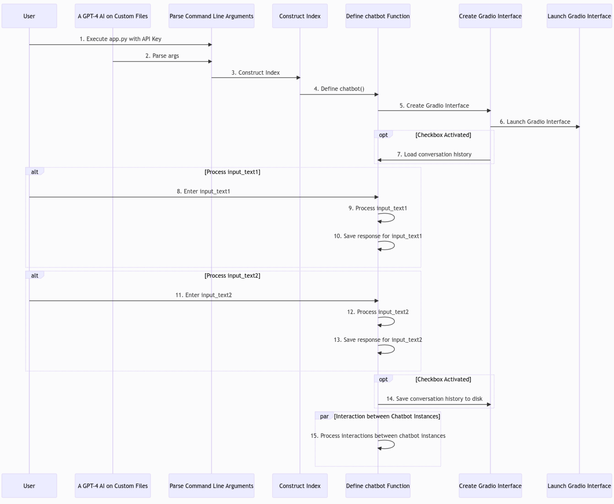

# GPTFusion - An AI Chatbot Mastering Multi-Model Integration & Dynamic Interactions
## Summary
- I developed a versatile AI chatbot that: works seamlessly with multiple GPT models; offers tailored document integration, conversation history management; and exhibits multi-input functionality on a client-facing API by leveraging Gradio, Python, and the OpenAI API.

## Key Features
1. **Establishing Robust File Type Coverage:** Integrated a vector index to efficiently ingest unstructured data within common file types, including native PDFs, CSVs, TXTs, and SQL files.
2. **Enabling User-Defined File Subsets as Input for NLP Operations:** Constructed a feature that facilitated users in specifying a subset of ingested files; users can enumerate any combination of desired filenames, which can be subsequently utilized as input for built-in NLP operations.
3. **Passing Previous User/AI Interactions to Future User Inputs:** Extended the ability of the baseline GPT API to now retain and call on prior user-defined prompts and responses, optionally across multiple chat sessions, and combine the recorded conversation history with user file subsets as a singular input for NLP tasks plus baseline GPT model operations.
4. **Parallelizing Dual GPT "Agents" and Optional Cross-Interaction:** Initialized two pairs of GPT "Agents" on the deployed Gradio interface, where users can optionally enable, via a checkbox: cross-instance interaction and chained prompt and answer pairs.

*Figure 1: Sequence diagram illustrating the GPT-4 AI system's primary components and interactions, highlighting optional conversation history access and parallel processing of input texts from two chatbot instances. Note the additional security on User API key handling as well as the integration of user input on the Gradio interface*.
